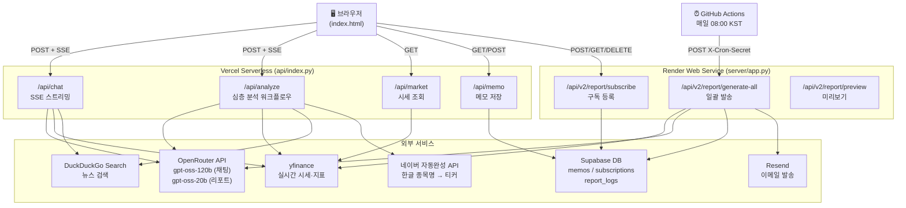
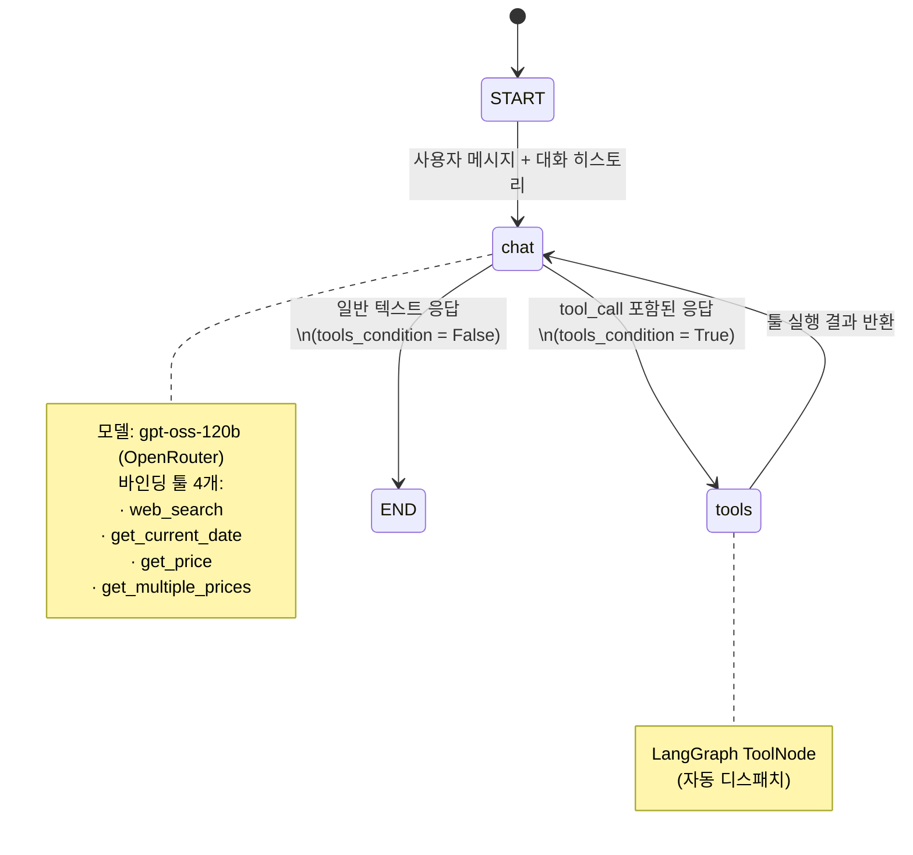
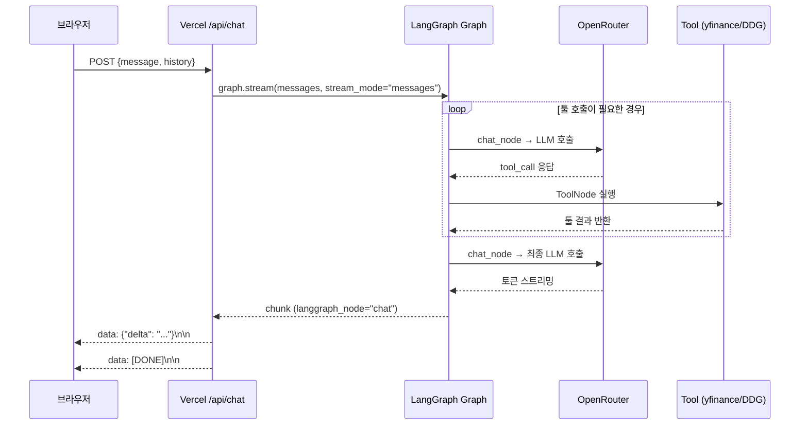
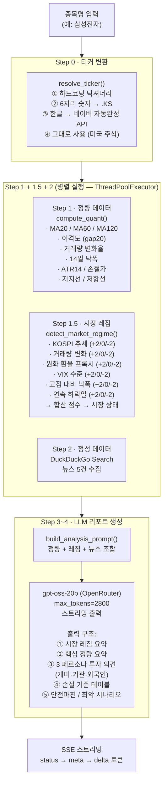
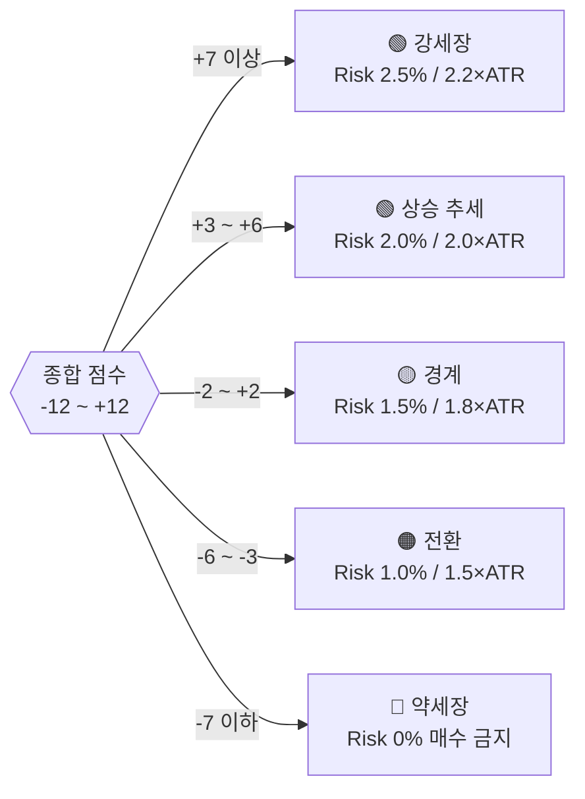
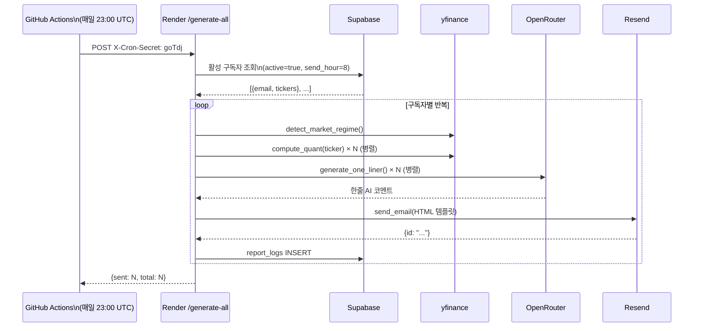
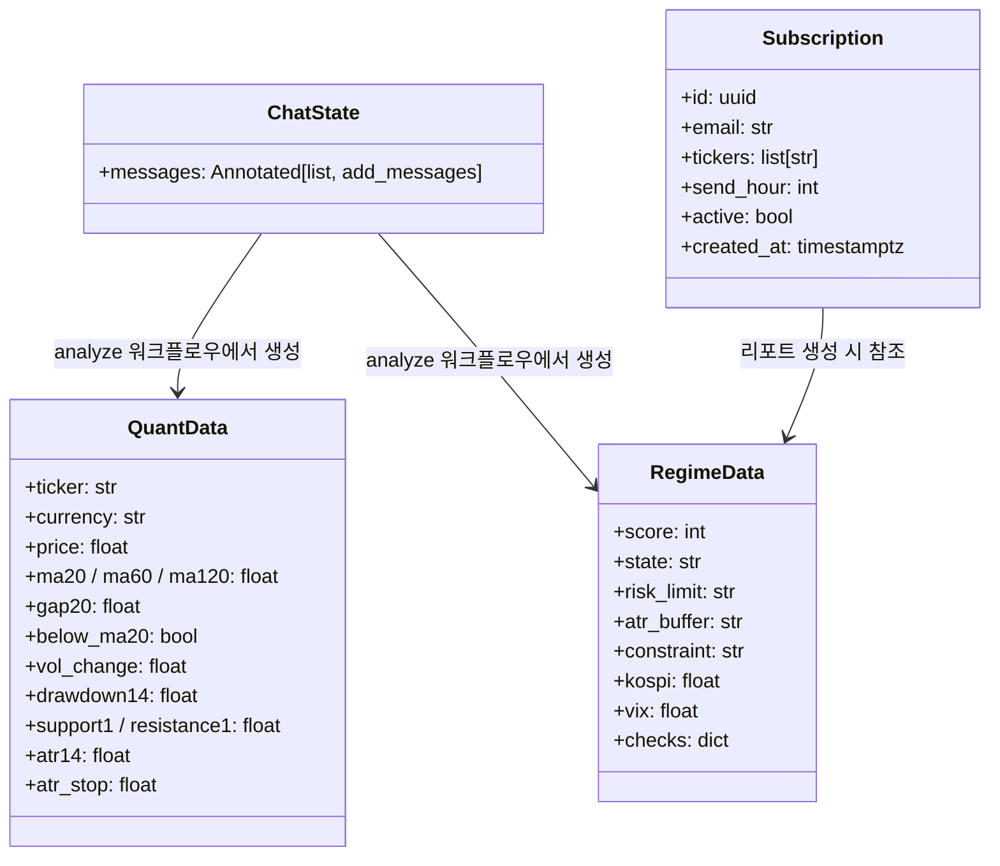

# MarketBot — LangGraph 서비스 구조도

## 1. 전체 시스템 구조



---

## 2. LangGraph 채팅 그래프 (일반 채팅)



### 채팅 SSE 스트리밍 흐름



---

## 3. 심층 분석 워크플로우 (/api/analyze)

LangGraph 그래프를 사용하지 않고 Python 코드로 직접 오케스트레이션하는 5단계 파이프라인.



### 시장 레짐 점수 체계



---

## 4. 정기 리포트 파이프라인



---

## 5. 상태(State) 구조



---

## 6. 도구(Tool) 명세

| 도구 | 호출 시점 | 구현 |
|------|----------|------|
| `web_search(query)` | 뉴스·이슈 검색 필요 시 | DuckDuckGo DDGS (max 5건) |
| `get_current_date()` | 날짜·시각 질문 시 | `datetime.now()` |
| `get_price(ticker)` | 단일 종목 시세 조회 | yfinance `fast_info` |
| `get_multiple_prices(tickers)` | 복수 종목 일괄 조회 | yfinance 반복 호출 |

> 위 4개 툴은 LangGraph `ToolNode`에 자동 등록되며, LLM이 `tool_call`을 포함한 응답을 반환하면 `tools_condition`이 감지해 자동 실행합니다.

---

## 7. 파일 구조

```
stockchat/
├── api/
│   ├── index.py          # Vercel 서버리스 진입점 (Flask + LangGraph)
│   └── index.html        # 프론트엔드 (Vanilla JS + marked.js)
│
├── server/
│   ├── app.py            # Render API 서버 (정기 리포트)
│   ├── cron_report.py    # GitHub Actions Cron 진입점
│   ├── requirements.txt
│   ├── Procfile
│   └── render.yaml
│
├── .github/
│   └── workflows/
│       └── daily-report.yml  # 매일 08:00 KST 크론
│
├── requirements.txt      # Vercel 의존성
├── vercel.json
└── README.md
```
